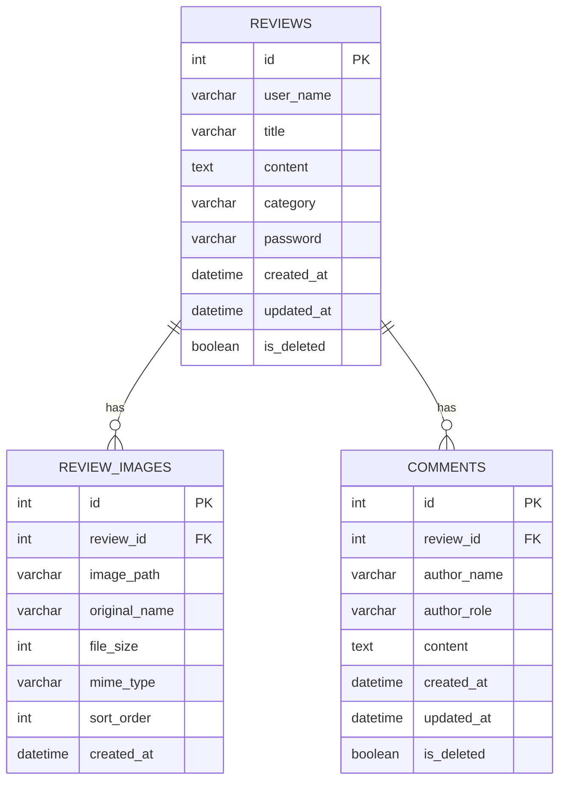

# PRD: HighOrder 리뷰 시스템

## 1. 프로젝트 개요

### 1.1 문서 정보
- **문서명**: HighOrder 리뷰 시스템 PRD (Product Requirements Document)
- **작성일**: 2025-11-27
- **버전**: 1.0
- **담당자**: Development Team

### 1.2 프로젝트 목적
HighOrder 테이블 주문 시스템을 도입한 고객사들의 실제 사용 후기를 수집하고 관리하는 시스템을 구축하여, 잠재 고객들에게 신뢰성 있는 정보를 제공하고 제품의 실질적인 가치를 입증합니다.

### 1.3 핵심 가치 제안
- **신뢰성**: 실제 고객들의 검증된 후기
- **투명성**: 다양한 카테고리별 실제 효과 입증
- **편의성**: 간편한 후기 작성 및 이미지 첨부
- **소통**: 관리자 댓글을 통한 양방향 커뮤니케이션

### 1.4 비즈니스 목표
- 제품 신뢰도 향상 (고객 후기 기반 신뢰 구축)
- 전환율 증대 (실제 사용 사례를 통한 구매 의사결정 지원)
- 고객 만족도 측정 (카테고리별 효과 분석)
- 고객 관계 강화 (관리자 답변을 통한 사후 관리)

---

## 2. 시스템 아키텍처

### 2.1 설계 원칙
본 시스템은 **Clean Architecture** 원칙을 엄격히 준수하여 설계되었습니다.

```
┌─────────────────────────────────────────────────────────┐
│                  Presentation Layer                     │
│  (UI Components, Pages, Hooks)                         │
├─────────────────────────────────────────────────────────┤
│                  Application Layer                      │
│  (Use Cases, Business Logic Orchestration)             │
├─────────────────────────────────────────────────────────┤
│                    Domain Layer                         │
│  (Entities, Repository Interfaces, Validators)         │
├─────────────────────────────────────────────────────────┤
│                Infrastructure Layer                     │
│  (Repository Implementations, Database, External APIs) │
└─────────────────────────────────────────────────────────┘
```

### 2.2 계층별 역할

#### Domain Layer (도메인 계층)
- **Entities**: 비즈니스 핵심 엔티티 정의
  - `Review`: 후기 엔티티
  - `Comment`: 댓글 엔티티
  - `ReviewImage`: 후기 이미지 메타데이터
  
- **Repository Interfaces**: 데이터 접근 추상화
  - `ReviewRepository`
  - `CommentRepository`
  - `ImageRepository`
  
- **Validators**: 비즈니스 규칙 검증
  - `ReviewValidator`: 후기 작성/수정 검증
  - `CommentValidator`: 댓글 작성 검증

#### Application Layer (애플리케이션 계층)
- **Use Cases**: 비즈니스 로직 오케스트레이션
  - `GetReviewsUseCase`: 후기 조회 및 통계
  - `CreateReviewUseCase`: 후기 생성
  - `DeleteReviewUseCase`: 후기 삭제
  - `GetCommentsUseCase`: 댓글 조회
  - `CreateCommentUseCase`: 댓글 생성
  - `DeleteCommentUseCase`: 댓글 삭제

#### Infrastructure Layer (인프라 계층)
- **Repository Implementations**: 실제 데이터 저장소 구현
  - `SqliteReviewRepository`: SQLite 기반 후기 저장소
  - `SqliteCommentRepository`: SQLite 기반 댓글 저장소
  - `LocalImageRepository`: 로컬 파일 시스템 기반 이미지 저장소
  
- **Database**: 데이터베이스 연결 및 관리
  - `DatabaseManager`: 싱글톤 DB 연결 관리
  - `schema.sql`: 테이블 스키마 정의
  
- **Services**: 외부 API 통신
  - `ReviewApiService`: 프론트엔드-백엔드 API 통신

#### Presentation Layer (프레젠테이션 계층)
- **Pages**: 라우트 페이지 컴포넌트
  - `ReviewsPage`: 전체 후기 페이지
  
- **Components**: UI 컴포넌트
  - `ReviewPage`: 후기 목록/작성 통합 컴포넌트
  - `ReviewCard`: 개별 후기 카드
  - `ReviewForm`: 후기 작성 폼
  - `CommentSection`: 댓글 섹션
  - `CategoryFilter`: 카테고리 필터
  - `ReviewStats`: 통계 표시
  
- **Hooks**: 비즈니스 로직 연결
  - `useReviews`: 후기 관리 훅
  - `useComments`: 댓글 관리 훅
  - `useCreateReview`: 후기 작성 훅

### 2.3 아키텍처 장점
- **관심사의 분리**: 각 계층이 독립적 책임 보유
- **의존성 역전**: 상위 계층이 하위 계층에 의존하지 않음
- **테스트 용이성**: 각 계층을 독립적으로 테스트 가능
- **유지보수성**: 변경 영향 최소화
- **확장성**: 새로운 기능 추가 용이

---

## 3. 주요 기능 명세

### 3.1 후기 관리 (Review Management)

#### 3.1.1 후기 작성 (Create Review)

**기능 설명**  
고객이 HighOrder 시스템 사용 후기를 작성합니다.

**사용자 스토리**
> "상호명 운영자로서, 시스템 도입 후 매출 증가 효과를 다른 사업자들과 공유하기 위해 후기를 작성하고 싶다."

**입력 필드**
| 필드명 | 타입 | 필수 여부 | 제약사항 | 설명 |
|--------|------|-----------|----------|------|
| userName | String | 필수 | 최대 100자 | 상호명 |
| category | String | 필수 | 6가지 중 선택 | 후기 카테고리 |
| password | String | 필수 | 최소 4자 | 후기 삭제용 비밀번호 |
| title | String | 필수 | 최대 200자 | 후기 제목 |
| content | Text | 필수 | 최대 2000자 | 후기 내용 |
| images | File[] | 선택 | 최대 4개, 각 5MB 이하 | 첨부 이미지 |

**카테고리 목록**
1. 매출이 늘었어요!
2. 인건비가 절약됐어요
3. 사후관리가 좋아요
4. 주문 실수가 줄었어요
5. 고객 응대가 편해졌어요
6. 디자인이 고급스러워요

**검증 규칙**
- 모든 필수 필드 입력 검증
- 비밀번호는 해시화하여 저장 (bcrypt)
- 이미지 형식: JPG, PNG, GIF, WebP만 허용
- 이미지 파일명: UUID로 변환하여 저장
- 욕설 및 부적절한 표현 필터링 (기본 필터 적용)

**성공 조건**
- 후기 데이터 DB 저장 성공
- 이미지 파일 시스템 저장 성공
- 통계 자동 업데이트
- 후기 목록 자동 갱신

---

#### 3.1.2 후기 조회 (Read Reviews)

**기능 설명**  
등록된 모든 후기를 최신순으로 조회하고, 카테고리별 필터링을 지원합니다.

**조회 옵션**
- 전체 조회 (기본값)
- 카테고리별 필터링
- 최신순 정렬 (고정)

**응답 데이터**
```typescript
{
  reviews: Review[],
  stats: {
    total: number,           // 전체 후기 수
    categoryStats: {         // 카테고리별 통계
      [category: string]: number
    }
  }
}
```

**UI 구성**
- 후기 카드 그리드 레이아웃
- 카테고리 필터 버튼
- 통계 대시보드
- 후기 작성 버튼 (하단 고정)

---

#### 3.1.3 후기 삭제 (Delete Review)

**기능 설명**  
작성자 본인 또는 관리자가 후기를 삭제합니다.

**삭제 방식**
1. **일반 사용자 삭제**: 비밀번호 인증 필요
2. **관리자 삭제**: JWT 토큰 인증 (비밀번호 불필요)

**삭제 프로세스**

**일반 사용자 플로우**
```
후기 카드 삭제 버튼 클릭
  ↓
비밀번호 입력 다이얼로그 표시
  ↓
비밀번호 검증 (bcrypt.compare)
  ↓
소프트 삭제 처리 (is_deleted = true)
  ↓
UI에서 즉시 제거
```

**관리자 플로우**
```
후기 카드 관리자 삭제 버튼 클릭
  ↓
확인 다이얼로그 표시
  ↓
JWT 토큰 검증
  ↓
소프트 삭제 처리 (is_deleted = true)
  ↓
UI에서 즉시 제거
```

**삭제 정책**
- 소프트 삭제 방식 (데이터 보존)
- 연관된 이미지 파일은 유지 (복구 가능성 고려)
- 연관된 댓글은 CASCADE 삭제

---

### 3.2 댓글 관리 (Comment Management)

#### 3.2.1 댓글 작성 (Create Comment)

**기능 설명**  
관리자가 고객 후기에 답변 댓글을 작성합니다.

**권한**  
- 관리자 전용 (JWT 토큰 인증 필요)
- 일반 사용자는 읽기만 가능

**입력 필드**
| 필드명 | 타입 | 필수 여부 | 제약사항 | 설명 |
|--------|------|-----------|----------|------|
| content | Text | 필수 | 최대 1000자 | 댓글 내용 |
| authorName | String | 자동 | "KT지니원" 고정 | 작성자명 |
| authorRole | String | 자동 | "admin" 고정 | 권한 |

**검증 규칙**
- JWT 토큰 유효성 검증
- 내용 필수 입력 검증
- 최대 길이 제한

---

#### 3.2.2 댓글 조회 (Read Comments)

**기능 설명**  
특정 후기에 달린 모든 댓글을 조회합니다.

**응답 데이터**
```typescript
{
  comments: Comment[],
  total: number
}
```

**표시 정보**
- 작성자명 (관리자는 "KT지니원"으로 표시)
- 권한 뱃지 (관리자 표시)
- 작성 시간
- 댓글 내용

---

#### 3.2.3 댓글 삭제 (Delete Comment)

**기능 설명**  
관리자가 작성한 댓글을 삭제합니다.

**권한**  
- 관리자 전용

**삭제 프로세스**
```
댓글 삭제 버튼 클릭
  ↓
확인 다이얼로그 표시
  ↓
JWT 토큰 검증
  ↓
소프트 삭제 처리 (is_deleted = true)
  ↓
UI에서 즉시 제거
```

---

### 3.3 이미지 관리 (Image Management)

#### 3.3.1 이미지 업로드

**저장 방식**  
- 로컬 파일 시스템 저장 (NAS 볼륨 마운트)
- 경로: `/public/uploads/reviews/[reviewId]/[uuid].[ext]`

**파일명 규칙**
- UUID v4 생성으로 충돌 방지
- 원본 확장자 유지

**메타데이터 저장**
```typescript
{
  id: string,              // 고유 ID
  reviewId: string,        // 후기 ID
  imagePath: string,       // 저장 경로
  originalName: string,    // 원본 파일명
  fileSize: number,        // 파일 크기 (bytes)
  mimeType: string,        // MIME 타입
  sortOrder: number,       // 정렬 순서
  createdAt: Date          // 생성 시간
}
```

#### 3.3.2 이미지 조회

**제공 방식**  
- Next.js Static File Serving
- URL: `/uploads/reviews/[reviewId]/[uuid].[ext]`

**갤러리 기능**
- 썸네일 그리드 표시
- 클릭 시 전체 화면 모달 표시
- 좌우 네비게이션
- 이미지 확대/축소 (선택)

---

### 3.4 통계 기능 (Statistics)

#### 3.4.1 전체 통계

**제공 지표**
- 전체 후기 수
- 카테고리별 후기 수
- 카테고리별 비율 (%)

**표시 위치**  
페이지 상단 대시보드

#### 3.4.2 카테고리별 통계

**계산 방식**
```typescript
categoryStats = {
  "매출이 늘었어요!": 45,
  "인건비가 절약됐어요": 32,
  "사후관리가 좋아요": 28,
  // ...
}
```

**UI 표시**
- 카테고리 필터 버튼에 개수 뱃지 표시
- 막대 그래프 (선택)

---

## 4. 데이터베이스 설계

### 4.1 테이블 스키마

#### 4.1.1 reviews (후기 테이블)

```sql
CREATE TABLE reviews (
    id INTEGER PRIMARY KEY AUTOINCREMENT,
    user_name VARCHAR(100) NOT NULL,
    title VARCHAR(200) NOT NULL,
    content TEXT NOT NULL,
    category VARCHAR(50) NOT NULL,
    password VARCHAR(255) NOT NULL,      -- bcrypt 해시값
    created_at DATETIME DEFAULT CURRENT_TIMESTAMP,
    updated_at DATETIME DEFAULT CURRENT_TIMESTAMP,
    is_deleted BOOLEAN DEFAULT FALSE
);
```

**인덱스**
- `idx_reviews_category` ON category
- `idx_reviews_created_at` ON created_at
- `idx_reviews_is_deleted` ON is_deleted

---

#### 4.1.2 review_images (후기 이미지 테이블)

```sql
CREATE TABLE review_images (
    id INTEGER PRIMARY KEY AUTOINCREMENT,
    review_id INTEGER NOT NULL,
    image_path VARCHAR(500) NOT NULL,
    original_name VARCHAR(255) NOT NULL,
    file_size INTEGER NOT NULL,
    mime_type VARCHAR(100) NOT NULL,
    sort_order INTEGER DEFAULT 0,
    created_at DATETIME DEFAULT CURRENT_TIMESTAMP,
    FOREIGN KEY (review_id) REFERENCES reviews(id) ON DELETE CASCADE
);
```

**인덱스**
- `idx_review_images_review_id` ON review_id
- `idx_review_images_sort_order` ON sort_order

---

#### 4.1.3 comments (댓글 테이블)

```sql
CREATE TABLE comments (
    id INTEGER PRIMARY KEY AUTOINCREMENT,
    review_id INTEGER NOT NULL,
    author_name VARCHAR(50) NOT NULL,
    author_role VARCHAR(10) NOT NULL CHECK (author_role IN ('admin', 'user')),
    content TEXT NOT NULL,
    created_at DATETIME DEFAULT CURRENT_TIMESTAMP,
    updated_at DATETIME DEFAULT CURRENT_TIMESTAMP,
    is_deleted BOOLEAN DEFAULT FALSE,
    FOREIGN KEY (review_id) REFERENCES reviews(id) ON DELETE CASCADE
);
```

**인덱스**
- `idx_comments_review_id` ON review_id
- `idx_comments_author_role` ON author_role
- `idx_comments_created_at` ON created_at
- `idx_comments_is_deleted` ON is_deleted

---

### 4.2 관계 다이어그램



---

### 4.3 데이터 무결성

#### 참조 무결성
- `review_images.review_id` → `reviews.id` (CASCADE DELETE)
- `comments.review_id` → `reviews.id` (CASCADE DELETE)

#### 제약 조건
- `comments.author_role`: 'admin' 또는 'user'만 허용
- `is_deleted`: 기본값 FALSE

#### 트리거
```sql
-- reviews 업데이트 시 updated_at 자동 갱신
CREATE TRIGGER update_reviews_updated_at 
    AFTER UPDATE ON reviews
    FOR EACH ROW
    BEGIN
        UPDATE reviews SET updated_at = CURRENT_TIMESTAMP WHERE id = NEW.id;
    END;

-- comments 업데이트 시 updated_at 자동 갱신
CREATE TRIGGER update_comments_updated_at 
    AFTER UPDATE ON comments
    FOR EACH ROW
    BEGIN
        UPDATE comments SET updated_at = CURRENT_TIMESTAMP WHERE id = NEW.id;
    END;
```

---

## 5. API 명세

### 5.1 후기 API

#### GET /api/reviews
**설명**: 모든 후기 조회 (통계 포함)

**Request**
```
GET /api/reviews
```

**Response** (200 OK)
```json
{
  "success": true,
  "data": {
    "reviews": [
      {
        "id": "1",
        "userName": "홍대맛집",
        "title": "매출이 20% 증가했어요!",
        "content": "하이오더 도입 후...",
        "category": "매출이 늘었어요!",
        "createdAt": "2024-11-20T10:30:00Z",
        "updatedAt": "2024-11-20T10:30:00Z",
        "isDeleted": false,
        "images": [
          {
            "id": "img-1",
            "reviewId": "1",
            "imagePath": "/uploads/reviews/1/abc-123.jpg",
            "originalName": "photo.jpg",
            "fileSize": 1024000,
            "mimeType": "image/jpeg",
            "sortOrder": 0,
            "createdAt": "2024-11-20T10:30:00Z"
          }
        ]
      }
    ],
    "stats": {
      "total": 150,
      "categoryStats": {
        "매출이 늘었어요!": 45,
        "인건비가 절약됐어요": 32,
        "사후관리가 좋아요": 28,
        "주문 실수가 줄었어요": 20,
        "고객 응대가 편해졌어요": 15,
        "디자인이 고급스러워요": 10
      }
    }
  }
}
```

---

#### POST /api/reviews
**설명**: 새 후기 작성

**Request**
```
POST /api/reviews
Content-Type: multipart/form-data

{
  userName: "홍대맛집",
  title: "매출이 20% 증가했어요!",
  content: "하이오더 도입 후...",
  category: "매출이 늘었어요!",
  password: "1234",
  images: [File, File, ...]  // 최대 4개
}
```

**Response** (200 OK)
```json
{
  "success": true,
  "data": {
    "id": "1",
    "userName": "홍대맛집",
    "title": "매출이 20% 증가했어요!",
    "content": "하이오더 도입 후...",
    "category": "매출이 늘었어요!",
    "createdAt": "2024-11-20T10:30:00Z",
    "updatedAt": "2024-11-20T10:30:00Z",
    "isDeleted": false,
    "images": [...]
  }
}
```

**Response** (400 Bad Request)
```json
{
  "success": false,
  "error": "Validation failed",
  "errors": {
    "userName": "이름을 입력해주세요",
    "password": "비밀번호는 4자 이상이어야 합니다"
  }
}
```

---

#### DELETE /api/reviews/[id]
**설명**: 후기 삭제 (비밀번호 인증)

**Request**
```
DELETE /api/reviews/1
Content-Type: application/json

{
  "password": "1234"
}
```

**Response** (200 OK)
```json
{
  "success": true,
  "message": "Review deleted successfully"
}
```

**Response** (401 Unauthorized)
```json
{
  "success": false,
  "error": "비밀번호가 일치하지 않습니다"
}
```

---

#### DELETE /api/reviews/[id]/admin
**설명**: 후기 삭제 (관리자 권한)

**Request**
```
DELETE /api/reviews/1/admin
Authorization: Bearer <JWT_TOKEN>
```

**Response** (200 OK)
```json
{
  "success": true,
  "message": "Review deleted by admin"
}
```

**Response** (403 Forbidden)
```json
{
  "success": false,
  "error": "관리자 권한이 필요합니다"
}
```

---

### 5.2 댓글 API

#### GET /api/reviews/[id]/comments
**설명**: 특정 후기의 댓글 조회

**Request**
```
GET /api/reviews/1/comments
```

**Response** (200 OK)
```json
{
  "success": true,
  "data": {
    "comments": [
      {
        "id": "comment-1",
        "reviewId": "1",
        "authorName": "KT지니원",
        "authorRole": "admin",
        "content": "소중한 후기 감사합니다!",
        "createdAt": "2024-11-20T11:00:00Z",
        "updatedAt": "2024-11-20T11:00:00Z",
        "isDeleted": false
      }
    ],
    "total": 1
  }
}
```

---

#### POST /api/reviews/[id]/comments
**설명**: 댓글 작성 (관리자 전용)

**Request**
```
POST /api/reviews/1/comments
Authorization: Bearer <JWT_TOKEN>
Content-Type: application/json

{
  "content": "소중한 후기 감사합니다!"
}
```

**Response** (200 OK)
```json
{
  "success": true,
  "data": {
    "id": "comment-1",
    "reviewId": "1",
    "authorName": "KT지니원",
    "authorRole": "admin",
    "content": "소중한 후기 감사합니다!",
    "createdAt": "2024-11-20T11:00:00Z",
    "updatedAt": "2024-11-20T11:00:00Z",
    "isDeleted": false
  }
}
```

**Response** (403 Forbidden)
```json
{
  "success": false,
  "error": "관리자 권한이 필요합니다"
}
```

---

#### DELETE /api/reviews/[id]/comments/[commentId]
**설명**: 댓글 삭제 (관리자 전용)

**Request**
```
DELETE /api/reviews/1/comments/comment-1
Authorization: Bearer <JWT_TOKEN>
```

**Response** (200 OK)
```json
{
  "success": true,
  "message": "Comment deleted successfully"
}
```

---

### 5.3 이미지 업로드 API

#### POST /api/reviews/upload
**설명**: 이미지 파일 업로드

**Request**
```
POST /api/reviews/upload
Content-Type: multipart/form-data

{
  image: File
}
```

**Response** (200 OK)
```json
{
  "success": true,
  "data": {
    "imageUrl": "/uploads/reviews/temp/abc-123.jpg"
  }
}
```

---

## 6. 기술 스택

### 6.1 프론트엔드

| 기술 | 버전 | 용도 |
|------|------|------|
| **Next.js** | 14.x | React 프레임워크, SSR/SSG |
| **React** | 18.x | UI 라이브러리 |
| **TypeScript** | 5.x | 타입 안정성 |
| **Tailwind CSS** | 3.x | 스타일링 |
| **shadcn/ui** | Latest | UI 컴포넌트 라이브러리 |

---

### 6.2 백엔드

| 기술 | 버전 | 용도 |
|------|------|------|
| **Next.js API Routes** | 14.x | RESTful API 서버 |
| **better-sqlite3** | Latest | SQLite 데이터베이스 드라이버 |
| **bcryptjs** | Latest | 비밀번호 해싱 |
| **uuid** | Latest | 고유 ID 생성 |

---

### 6.3 인프라

| 기술 | 용도 |
|------|------|
| **SQLite** | 관계형 데이터베이스 |
| **Local File System** | 이미지 저장 (NAS 볼륨 마운트) |
| **Docker** | 컨테이너화 배포 |
| **Nginx** | 리버스 프록시 |

---

### 6.4 개발 도구

| 도구 | 용도 |
|------|------|
| **Jest** | 단위 테스트 |
| **ESLint** | 코드 품질 검사 |
| **Prettier** | 코드 포매팅 |

---

## 7. 보안 요구사항

### 7.1 인증 및 권한

#### 7.1.1 후기 삭제 인증
- **일반 사용자**: 작성 시 설정한 비밀번호로 인증
- **비밀번호 저장**: bcrypt 해시 (salt rounds: 10)
- **비밀번호 검증**: bcrypt.compare() 사용

#### 7.1.2 관리자 인증
- **JWT 토큰 기반 인증**
- 토큰 만료 시간: 24시간
- 토큰 저장: httpOnly 쿠키
- 관리자 로그인 페이지: `/admin/chatbot/login`

---

### 7.2 입력 검증

#### 7.2.1 클라이언트 사이드 검증
- 필수 필드 입력 검증
- 문자열 길이 제한
- 파일 타입/크기 검증

#### 7.2.2 서버 사이드 검증
- 모든 사용자 입력 재검증
- SQL Injection 방어 (Prepared Statements)
- XSS 방어 (입력 이스케이핑)
- CSRF 방어 (Next.js 기본 제공)

---

### 7.3 파일 업로드 보안

#### 7.3.1 파일 검증
- **허용 MIME 타입**: image/jpeg, image/png, image/gif, image/webp
- **최대 파일 크기**: 5MB
- **파일명 변환**: UUID로 변환하여 저장
- **확장자 검증**: MIME 타입과 확장자 일치 확인

#### 7.3.2 저장소 보안
- 업로드 디렉토리 실행 권한 제거
- 웹 서버를 통한 직접 접근 차단
- Next.js Static File Serving을 통한 안전한 제공

---

### 7.4 데이터 보호

#### 7.4.1 민감 정보 처리
- 비밀번호는 해시값만 저장 (평문 저장 금지)
- 데이터베이스 백업 암호화
- 로그에 민감 정보 기록 금지

#### 7.4.2 소프트 삭제
- 데이터 즉시 삭제하지 않음 (is_deleted 플래그)
- 복구 가능성 보장
- 주기적 물리 삭제 정책 (90일 후)

---

## 8. 비기능 요구사항

### 8.1 성능

| 항목 | 목표 |
|------|------|
| **페이지 로딩 시간** | 3초 이내 (First Contentful Paint) |
| **API 응답 시간** | 500ms 이내 (평균) |
| **이미지 로딩** | Lazy Loading 적용 |
| **동시 접속** | 100명 이상 처리 가능 |

---

### 8.2 확장성

#### 8.2.1 데이터 증가 대응
- 후기 1만 개까지 성능 저하 없이 지원
- 페이지네이션 준비 (현재 미적용)
- 인덱스 최적화

#### 8.2.2 기능 확장 가능성
- Clean Architecture로 새 기능 추가 용이
- 리포지토리 패턴으로 DB 교체 가능 (SQLite → PostgreSQL)
- 이미지 저장소 교체 가능 (Local → S3)

---

### 8.3 가용성

| 항목 | 목표 |
|------|------|
| **서비스 가동률** | 99% 이상 |
| **백업** | 일 1회 자동 백업 |
| **복구 시간** | 1시간 이내 (RTO) |
| **데이터 손실** | 24시간 이내 데이터 (RPO) |

---

### 8.4 사용성

#### 8.4.1 반응형 디자인
- 모바일, 태블릿, 데스크톱 지원
- Breakpoint: 640px, 768px, 1024px, 1280px

#### 8.4.2 접근성
- 시맨틱 HTML 사용
- 키보드 네비게이션 지원
- ARIA 레이블 적용

#### 8.4.3 사용자 경험
- 로딩 상태 표시
- 에러 메시지 명확화
- 성공/실패 피드백 제공

---

## 9. 제약사항 및 가정

### 9.1 제약사항

#### 9.1.1 기술적 제약
- SQLite 사용으로 동시 쓰기 제한 (단일 프로세스 환경 적합)
- 로컬 파일 시스템 저장 (NAS 의존성)
- Next.js 14 App Router 사용 (Pages Router 미지원)

#### 9.1.2 비즈니스 제약
- 회원 가입 없이 익명 작성 (비밀번호만 사용)
- 후기 수정 기능 미제공 (삭제 후 재작성)
- 좋아요/공감 기능 미제공

---

### 9.2 가정

1. **트래픽 가정**
   - 일 방문자: 1,000명 미만
   - 월 신규 후기: 50개 미만

2. **데이터 가정**
   - 평균 후기 길이: 500자
   - 평균 첨부 이미지: 2개
   - 평균 이미지 크기: 2MB

3. **환경 가정**
   - Docker 컨테이너 배포
   - NAS 볼륨 마운트 가능
   - HTTPS 적용 (리버스 프록시)

---

## 10. 향후 확장 계획

### 10.1 Phase 2 (향후 3개월)

#### 10.1.1 기능 추가
- [ ] 페이지네이션 (무한 스크롤 or 페이지 번호)
- [ ] 후기 검색 기능 (키워드 검색)
- [ ] 좋아요/공감 기능
- [ ] 후기 공유 기능 (SNS 연동)

#### 10.1.2 성능 개선
- [ ] 이미지 최적화 (WebP 변환, 리사이징)
- [ ] CDN 연동 (이미지 전송 속도 개선)
- [ ] 캐싱 전략 (Redis 도입 검토)

---

### 10.2 Phase 3 (향후 6개월)

#### 10.2.1 분석 기능
- [ ] 후기 감성 분석 (긍정/부정 비율)
- [ ] 카테고리별 트렌드 분석
- [ ] 키워드 워드클라우드

#### 10.2.2 관리자 기능
- [ ] 후기 관리 대시보드
- [ ] 통계 차트 (월별/카테고리별)
- [ ] 부적절 후기 신고 기능

---

### 10.3 Phase 4 (향후 1년)

#### 10.3.1 고도화
- [ ] 회원 시스템 도입 (선택)
- [ ] 포인트/리워드 시스템
- [ ] 베스트 후기 선정
- [ ] 후기 랭킹 시스템

#### 10.3.2 인프라 개선
- [ ] PostgreSQL 마이그레이션
- [ ] AWS S3 이미지 저장소
- [ ] CI/CD 파이프라인 구축
- [ ] 모니터링 시스템 (Sentry, LogRocket)

---

## 11. 테스트 전략

### 11.1 단위 테스트 (Unit Test)

#### 11.1.1 Domain Layer
```typescript
// ReviewValidator 테스트
describe('ReviewValidator', () => {
  test('필수 필드 검증', () => {
    const result = ReviewValidator.validateCreateReview({
      userName: '',
      title: '',
      content: '',
      category: '',
      password: ''
    });
    expect(result.isValid).toBe(false);
    expect(result.errors).toHaveProperty('userName');
  });

  test('이미지 개수 제한', () => {
    const images = new Array(5).fill(mockFile);
    const result = ReviewValidator.validateCreateReview({
      userName: '테스트',
      title: '제목',
      content: '내용',
      category: '매출이 늘었어요!',
      password: '1234',
      images
    });
    expect(result.isValid).toBe(false);
    expect(result.errors).toHaveProperty('images');
  });
});
```

---

### 11.2 통합 테스트 (Integration Test)

#### 11.2.1 API 테스트
```typescript
describe('POST /api/reviews', () => {
  test('후기 작성 성공', async () => {
    const formData = new FormData();
    formData.append('userName', '홍대맛집');
    formData.append('title', '매출 증가!');
    formData.append('content', '하이오더 최고!');
    formData.append('category', '매출이 늘었어요!');
    formData.append('password', '1234');

    const response = await fetch('/api/reviews', {
      method: 'POST',
      body: formData
    });

    expect(response.status).toBe(200);
    const data = await response.json();
    expect(data.success).toBe(true);
    expect(data.data).toHaveProperty('id');
  });
});
```

---

### 11.3 E2E 테스트 (End-to-End Test)

#### 11.3.1 사용자 플로우 테스트
```typescript
describe('후기 작성 플로우', () => {
  test('전체 후기 작성 프로세스', async () => {
    // 1. 페이지 접근
    await page.goto('/reviews');
    
    // 2. 작성 버튼 클릭
    await page.click('[data-testid="write-review-button"]');
    
    // 3. 폼 작성
    await page.fill('[name="userName"]', '홍대맛집');
    await page.selectOption('[name="category"]', '매출이 늘었어요!');
    await page.fill('[name="password"]', '1234');
    await page.fill('[name="title"]', '매출 증가!');
    await page.fill('[name="content"]', '하이오더 최고!');
    
    // 4. 이미지 업로드
    await page.setInputFiles('[name="images"]', ['test-image.jpg']);
    
    // 5. 제출
    await page.click('[type="submit"]');
    
    // 6. 성공 확인
    await page.waitForSelector('[data-testid="review-card"]');
    const reviewText = await page.textContent('[data-testid="review-card"]');
    expect(reviewText).toContain('홍대맛집');
  });
});
```

---

### 11.4 테스트 커버리지 목표

| 계층 | 목표 커버리지 |
|------|--------------|
| **Domain Layer** | 95% 이상 |
| **Application Layer** | 85% 이상 |
| **Infrastructure Layer** | 70% 이상 |
| **Presentation Layer** | 60% 이상 |

---

## 12. 배포 및 운영

### 12.1 배포 환경

#### 12.1.1 Docker 컨테이너
```dockerfile
FROM node:18-alpine

WORKDIR /app

# 의존성 설치
COPY package*.json ./
RUN npm ci --only=production

# 소스 복사
COPY . .

# Next.js 빌드
RUN npm run build

# 포트 노출
EXPOSE 3000

# 실행
CMD ["npm", "start"]
```

#### 12.1.2 Docker Compose
```yaml
version: '3.8'

services:
  highorder-web:
    build: .
    ports:
      - "3000:3000"
    volumes:
      - ./data:/app/data                    # SQLite DB
      - ./public/uploads:/app/public/uploads # 이미지 저장소
    environment:
      - NODE_ENV=production
      - DATABASE_PATH=/app/data/reviews.db
    restart: unless-stopped
```

---

### 12.2 백업 전략

#### 12.2.1 데이터베이스 백업
- **주기**: 일 1회 (오전 4시)
- **보관 기간**: 30일
- **백업 명령**:
  ```bash
  sqlite3 /app/data/reviews.db ".backup '/app/backups/reviews_$(date +%Y%m%d).db'"
  ```

#### 12.2.2 이미지 파일 백업
- **주기**: 주 1회 (일요일)
- **보관 기간**: 90일
- **백업 명령**:
  ```bash
  tar -czf /app/backups/uploads_$(date +%Y%m%d).tar.gz /app/public/uploads
  ```

---

### 12.3 모니터링

#### 12.3.1 로그 관리
- **로그 수준**: ERROR, WARN, INFO
- **로그 위치**: `/app/logs/app.log`
- **로그 로테이션**: 일 1회, 30일 보관

#### 12.3.2 성능 모니터링
- CPU 사용률
- 메모리 사용량
- 디스크 사용량
- API 응답 시간

---

## 13. 부록

### 13.1 용어 정의

| 용어 | 정의 |
|------|------|
| **Clean Architecture** | 관심사의 분리를 통해 독립적이고 테스트 가능한 코드 구조를 만드는 설계 패턴 |
| **소프트 삭제** | 데이터를 물리적으로 삭제하지 않고 is_deleted 플래그로 논리적 삭제 처리 |
| **JWT (JSON Web Token)** | 인증 정보를 JSON 형태로 안전하게 전송하기 위한 토큰 기반 인증 방식 |
| **UUID** | 전역 고유 식별자 (Universally Unique Identifier) |
| **NAS** | Network Attached Storage, 네트워크 연결 저장소 |

---

### 13.2 참고 문서

- [Next.js Documentation](https://nextjs.org/docs)
- [Clean Architecture (Robert C. Martin)](https://blog.cleancoder.com/uncle-bob/2012/08/13/the-clean-architecture.html)
- [SQLite Documentation](https://www.sqlite.org/docs.html)
- [bcrypt.js Documentation](https://github.com/dcodeIO/bcrypt.js)

---

### 13.3 변경 이력

| 버전 | 날짜 | 변경 내용 | 작성자 |
|------|------|-----------|--------|
| 1.0 | 2024-11-27 | 초안 작성 | Development Team |


---

## 문의

기술적 문의사항이나 개선 제안은 개발팀에 문의해주세요.

**문서 종료**

